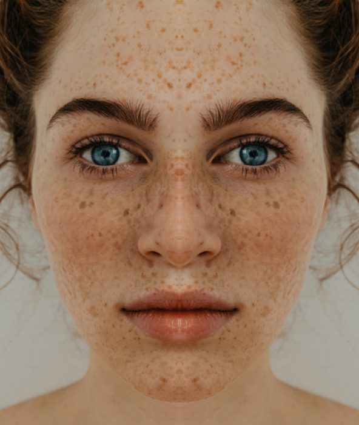

# doubleReFaceAugmentation

## Method
  Improve face classification accuracy with the help of crop image and create two images from raw image
## Augmentation Example

   

   

Second images are raw images and first images are created from left side of raw images and third images are created from right side of raw images

## Results

| Augmentation  | Train Accuracy | Train Loss | Validation  Accuracy | Validation Loss | Epochs |
| ------------- |:--------------:|:----------:|:--------------------:|:---------------:|:------:| 
|    without    |    `0.9960`    |  `0.0296`  |       0.9962         |     0.0463      |   10   |
|     with      |     0.9934     |   0.0307   |         `1`          |    `0.0040`     |   10   |

## Requirements
* [tensorflow](https://github.com/tensorflow/tensorflow)

* [opencv](https://github.com/opencv/opencv)

* [numpy](https://github.com/numpy/numpy)

## TODO
→~Complete train images augmentation~

→~Create CNN~ 

→~Test with augmentation and without augmentation~

→Design automatic augmentation

## Authors
* **Ozan PEKER** - [ghostronintr](https://github.com/ghostronintr)
